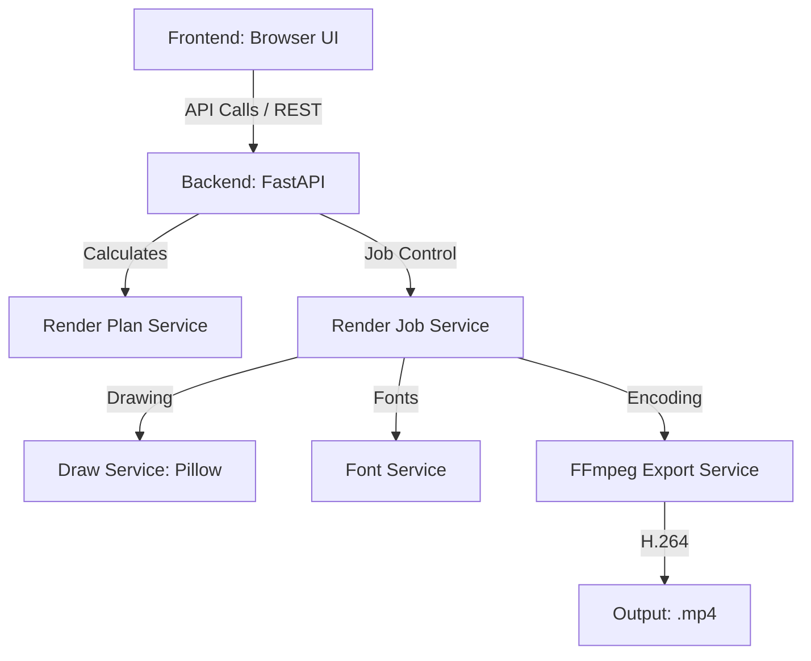

# Architecture Guide

The **Local Timer Renderer** is a multi-stage video generation application designed for performance, modularity, and local-first execution.

## 🏛️ System Overview

The project is split into a **FastAPI Backend** and an **ES-module Frontend**, connected via a RESTful API.

## 🏗️ Core Backend Services

### 1. `planning_service.py`
Determines the mathematical mapping for the requested duration.
- **Inputs**: Timer duration, FPS, format.
- **Logic**: Calculates total frames and verifies start/mid/end display values.
- **Optimization**: Flags the job as `is_optimized` for compatible formats.

### 2. `frame_render_service.py` (The Heart)
Handles the rendering loop. To achieve high performance, it uses an **Optimized Render Path**:
- Instead of rendering every single frame (e.g., 216,000 for 1 hour at 60fps), it renders one image per **unique displayed second** (e.g., 3,601 images).
- This results in a ~98.3% reduction in Pillow drawing and disk I/O operations for 60fps videos.

### 3. `draw_service.py`
The visual engine that renders individual frames as PIL images.
- Uses **Style Presets** (e.g., `minimal`, `watch_frame`) to apply backgrounds, shapes, and font styling.

### 4. `ffmpeg_export_service.py`
Orchestrates the assembly of PNG sequences into a final MP4 video.
- **High-FPS Duplication**: For optimized jobs, it uses `-framerate 1` and `-r {target_fps}`. FFmpeg efficiently duplicates the per-second images to reach the desired length.
- **GPU Acceleration**: Utilizes `h264_nvenc` when NVIDIA hardware is detected, falling back to `libx264` (CPU) otherwise.

## 🚦 Render Job Lifecycle

1. **Planning (REST POST `/api/render/plan`)**: User inputs settings; backend returns the plan.
2. **Creation (REST POST `/api/render/jobs`)**: Job is queued and assigned a unique ID.
3. **Execution (Background Thread)**:
    - **Status: `running`**: Rendering unique frame PNGs into `app/outputs/jobs/{job_id}/frames/`.
    - **Status: `encoding_video`**: FFmpeg compiles frames into `final_render.mp4`.
4. **Completion**: Artifacts are ready for download/preview.

## 🚀 Startup & Launcher

The `start.ps1` PowerShell script acts as the primary entry point:
- **Environment Setup**: Detects or creates a `.venv` and installs `requirements.txt`.
- **Port Discovery**: Scans for an available port starting from 8001. If the app is already detected running on a port, it reuses it; otherwise, it finds the next free TCP port.
- **Readiness Handling**: Waits for the `/api/system/status` check to pass before opening the browser.
